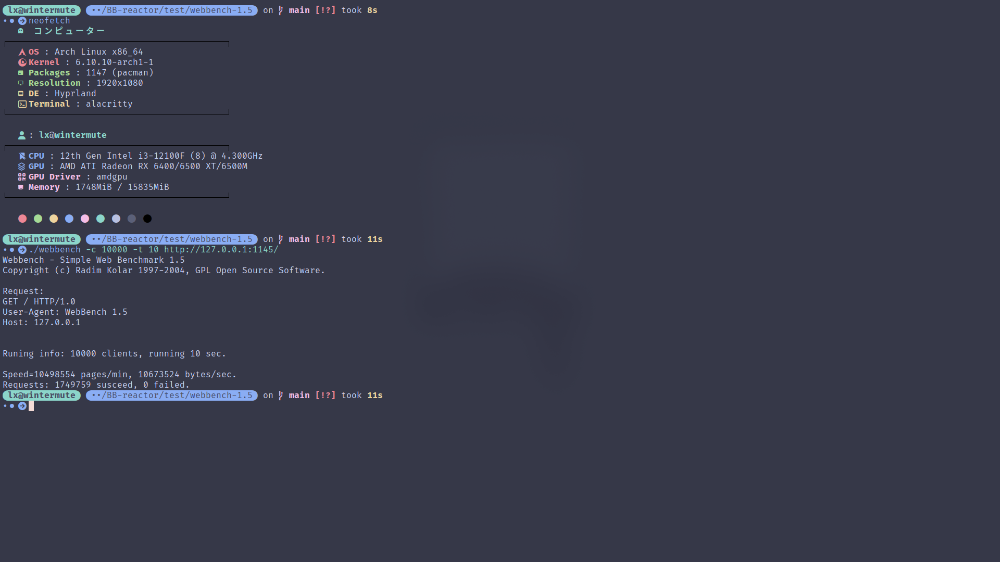

## 框架介绍
整体框架可概括为：主从reactor+线程池，从reactor仅有一个。
mainReactor响应连接事件，subReactor响应正常的io事件以及断开连接事件。io以及业务逻辑交由线程池执行。

从网上教程来看，主从reactor模式有多个从reactor，每个subReactor绑定一个cpu核心，从而提高并发能力。
但该框架存在一些缺陷，即每个连接都和某个subReactor绑定，而如果某个subReactor绑定的socket非常“活跃”，其他subReactor绑定的socket极少“活跃”，则会存在：即使有cpu空闲，“活跃”的socket也只会“挤占”与该subReactor绑定的cpu。
因此尝试socket与subReactor解绑，此时subReactor的数量与并发度关联不大，可以由一个subReactor监听所有的socket。

性能代价分为两部分，一部分是：由于需要唤醒线程，会牺牲一点点性能。另一部分是：如果线程池的任务队列已满，将由subReactor的线程处理io以及业务，如果在此期间线程池的任务迅速完成，存在空闲的cpu，那么同批次的事件需要等待subReactor的线程完成io以及业务逻辑，然后再交由线程池处理。后者发生概率应该是比较低的，而且可以通过设置一个较大的任务队列尽量避免。

## 小测一下
不严谨的小测一下，只有两个核心，基本上客户端服务端各占一个，没能体现多核心工作的性能。

测试环境：

- OS: Ubuntu 22.04.4 LTS
- CPU: Intel Xeon Gold 6133（2）@ 2.49GHz
- Memroy: 1963MB

测试内容：

- 通过修改webbench源码，测试长连接
- 尚未实现解析http请求功能，服务端接收http请求，直接回复1MB字节数据
- webbench 参数： -c 1000 -t 5

测试结果：

## 使用
无第三方依赖，但需要自行实现接口，参考测试案例。测试案例使用第三方库[sockpp](https://github.com/fpagliughi/sockpp.git)实现socket发送、接收等功能，具体步骤：

- 特化实现`abstract.hpp`中的接口类
- 特化`server`类，重载`readInfo`实现业务逻辑

## 组件介绍
### Epoll
Linux的epoll貌似只有增删改的功能，通过`std::unordered_map`，记录添加的文件描述符和事件，实现在原有功能上添加查找功能。仅作为`Reactor`子类。

### Reactor
`Reactor`基于epoll实现，为了简易使用，对epoll的功能有所取舍。
可以设置`Reactor`的默认事件和触发模式，即该`Reactor`的所有文件描述符具有相同的事件和触发模式。
可以添加多个不同类别的`Reactor`处理更复杂的需求，同一个文件描述符可以被多个epoll接管。

- `enroll` : 添加socket，并为其使用`defaultConfig`，设置事件和触发模式
- `logout` : 删除socket

事件分为四类：

- EPOLLIN: 内核接受缓冲区不空
- EPOLLOUT: 内核发送缓冲区不满
- EPOLLRDHUP: 当客户端关闭写入功能，服务端接收FIN，关闭服务端socket接收功能，服务端socket处于半连接状态
- EPOLLHUP: 服务端socket已经关闭读写功能

相应的，有四个回调函数处理：

- `recv` : 对应EPOLLIN，处理同一批次的可读事件
- `send` : 对应EPOLLOUT，处理同一批次的可写事件
- `diconnect` : 对应EPOLLRDHUP，准备断开与客户端的连接
- `clean` : 对应EPOLLHUP，已经断开连接，准备回收内存资源

### Channel
封装多线程场景下socket读写功能。框架使用线程池，可以保证线程池的任务缓冲队列以及正在执行的任务中，每个Channel只有一项接收任务或发送任务，该功能由下文将提到的`Valve`实现，Channel提供两个方法：

- `tryReadyRecv` : 当线程池的任务缓冲队列以及正在执行的任务中，存在该Channel的接收任务则返回false，否则返回true。特别地，可以失能Channel接收功能，如果接受功能失能，则返回false
- `tryReadySend` : 当线程池的任务缓冲队列以及正在执行的任务中，存在该Channel的发送任务则返回false，否则返回true。特别地，可以失能Channel发送功能，如果接受功能失能，则返回false

如果执行`tryReadyRecv`或`tryReadySend`期间，有cpu正在执行接收或发送任务，在执行结束后，该cpu将再次执行接收或发送任务

由于内核缓冲区有限，为保证某次用户层数据的写入内核缓冲区，再设置额外的缓冲区。`Channel`提供两个方法：
- `trySend` : 尝试将用户层的数据写入内核缓冲区，完整写入则返回true，否则返回false，并将剩余数据写入用户层缓冲区
- `trySendRest` : 由subReactor响应可写入事件，调用`trySendRest`，尝试将剩余数据写入内核缓冲区，完整写入则返回true，否则返回false

应当注意，不能无限制地调用`trySend`。如果某次发送的数据过大，仍应分包发送。可以根据`trySend`和`trySendRest`的返回值维护某次发送的阶段状态(已完成、等待完成)。

### Valve
`Valve`本义是“阀门”，取“控制流动”的词义，即控制用户层缓冲区和内核层缓冲区之间的数据流。仅作为`Channel`的子类，实现：线程池的任务缓冲队列以及正在执行的任务中，每个Channel只有一项接收任务或发送任务。`Channel`有两个`Valve`，分别管理`Channel`的读缓冲区和写缓冲区。

`Valve`本质是一个状态机，包括`open, shut, ready, busy, idle`五个状态：
- `open` : `Valve`使能
- `shut` : `Valve`失能
- `ready` : `Valve`开始数据传输
- `busy` : `Valve`执行数据传输
- `idle` : `Valve`完成数据传输

包括`tryTurnOnWithAgain,tryStartUpWithAgain,tryEnable(predicate),tryDisable(predicate)`四个方法：
- `tryTurnOnWithAgain` : 尝试分发IO任务，如果以及存在IO任务尚未完成则返回false，否则返回true。如果`Valve`失能则返回false。
- `tryStartUpWithAgain` : 尝试开始数据传输，如果上次任务已经完成且无新任务则返回true，否则返回false。如果`Valve`失能则返回false。
- `tryEnable` : 尝试开启分发IO任务，当内核写缓冲区写满执行该函数。接受一个谓词，可设置谓词为判断用户层缓冲区是否为空，如果不为空，且`Valve`失能，则返回true，否则返回false
- `tryDisable` : 尝试关闭分发IO任务，当用户写缓冲区读空执行该函数。接受一个谓词，可设置谓词为判断用户层缓冲区是否为空，如果为空则返回true，否则返回false

Linux的epoll存在一些小问题：即使处于EPOLLET触发模式，发送缓冲区一直不满，响应EPOLLIN会顺带响应EPOLLOUT。
为了过滤预期之外的EPOLLOUT事件，配合使用`tryTurnOnWithAgain`和`tryStartUpWithAgain`，可以实现处理EPOLLOUT最多同时占用一个线程。

### ThreadPool
一个具备必要功能的线程池，比较简单，底层使用信号量通知消费者线程。拒绝策略是在当前线程执行拟交给线程池的任务。出于性能考虑，每次添加任务不release信号，而是一次性处理一批次。

- `append` : 添加任务
- `distribute` : release 此次添加的任务数量，如果超出任务缓冲队列的最大数量限制，则由执行`distribute`的线程执行缓冲队列中的任务，完成任务再次尝试release信号
- `lock, unlock` : 同样出于性能考虑，在处理一个批次的任务的前后`lock,unlock`

### Keeper
`Keeper<Key,Value>`相当于`std::unordered_map<Key,std::shared_ptr<Value>>`和`std::weak_ptr<Value>`的结合体 <strike>使用方法比weak_ptr优雅</strike> 。考虑多线程场景，资源可能在使用前已被销毁或使用过程中被销毁，执行任务的线程需要尝试暂时拥有该资源的所有权。`Keeper`作为管理资源的中介，向线程“出租”资源，并需要线程“归还”资源，当资源已被“归还”才能释放销毁。特别的，`Keeper`本身也是资源，因此仍需考虑其自身与线程的生命周期问题。

- `obtain` : 获取接管资源
- `discard` : 删除资源
- `takeOut` : “出租”资源，私有成员
- `takeBack` : “回收”资源，私有成员
- `lend` : 调用`takeOut`，并且返回值为`Temp`
- `Temp` : `Keeper`的友元类，应当永远是右值属性，离开作用域则析构，析构将调用`takeBack`

## TODO
- [] 实现对象池功能，复用`Channel`
